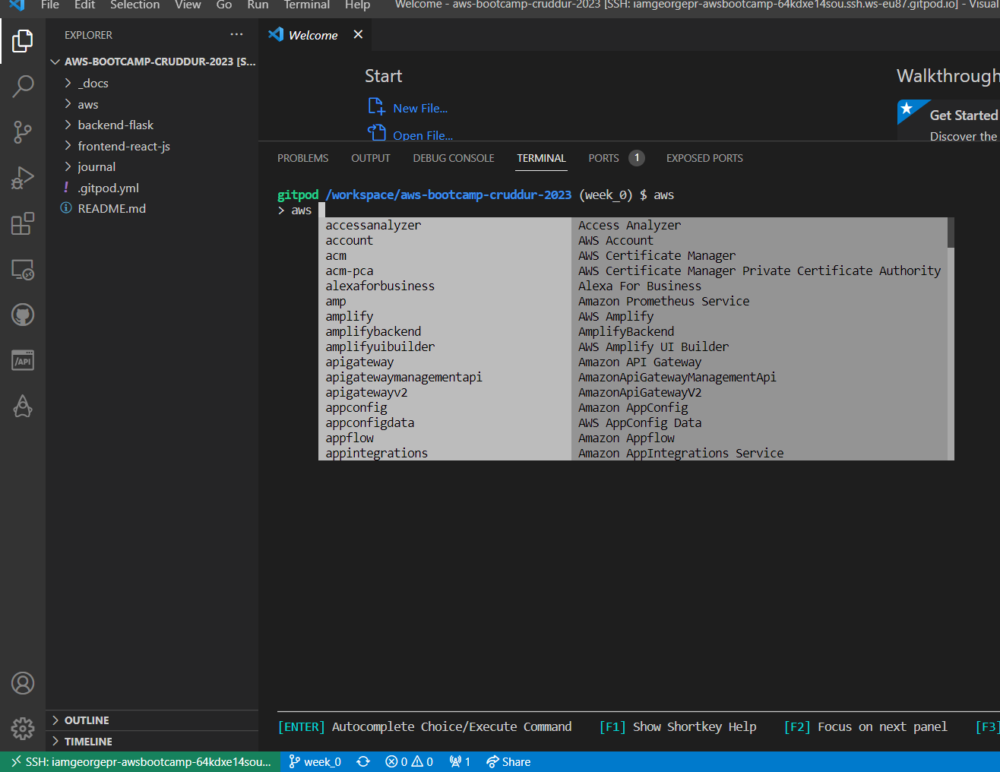
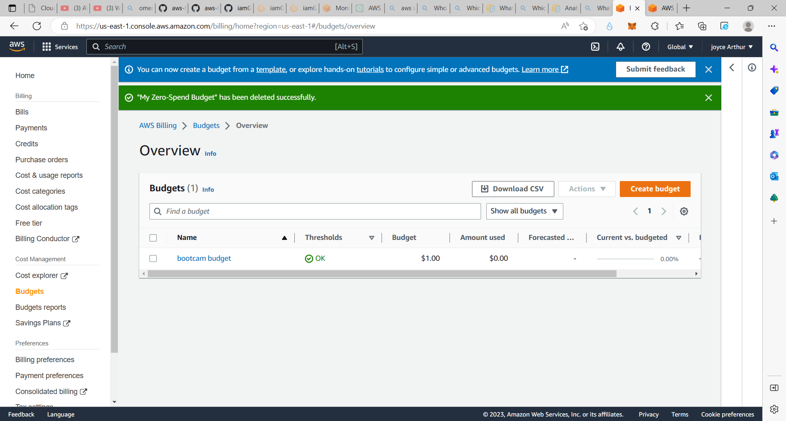
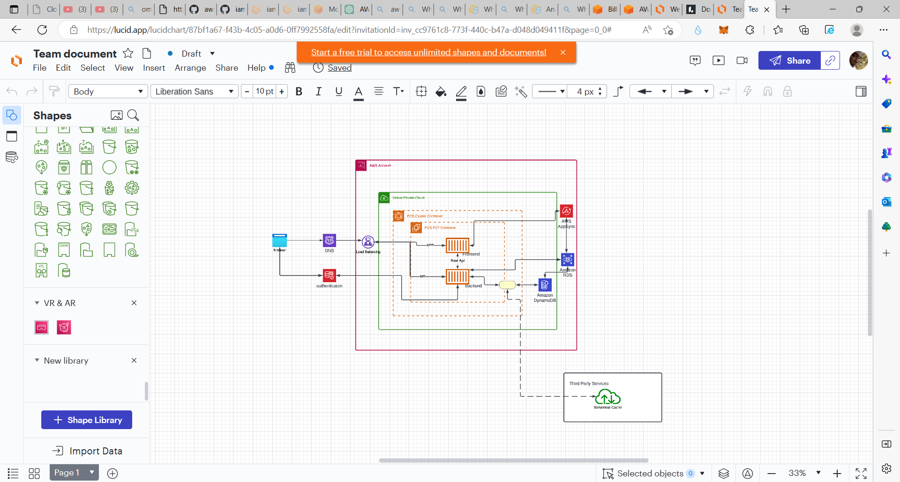

# Week 0 — Billing and Architecture

 
To ensure the security of my AWS account, I destroyed my root account credentials, set up multi-factor authentication (MFA), and created an IAM role with the necessary permissions for my tasks. I followed these steps:

I created a new IAM user with the necessary permissions for my tasks.
I enabled MFA on my root account and the new IAM user.
I logged in as the new IAM user and disabled access keys for the root account.
I created a new IAM role with the necessary permissions and assigned it to the new IAM user.

### Install and Verify AWS CLI

I downloaded the AWS CLI installer from the AWS CLI Install Instructions page.

I extracted the installer.

I installed the AWS CLI.

I configured the AWS CLI to use partial autoprompt mode.

I closed the terminal and opened a new one to apply the changes.

To test the AWS CLI installation, I ran the command "aws --version".

After completing these steps, I can use the AWS CLI to interact with my AWS resources and services.

I followed the instructions on the [AWS CLI Install Documentation Page](https://docs.aws.amazon.com/cli/latest/userguide/getting-started-install.html)




### Create a Budget

I opened a text editor and created a new file with a .json extension.

I copied and pasted the following JSON code into the file:

```json
{
    "BudgetLimit": {
        "Amount": "1",
        "Unit": "USD"
    },
    "BudgetName": "bootcam budget",
    "BudgetType": "COST",
    "CostFilters": {
        "TagKeyValue": [
            "user:Key$value1",
            "user:Key$value2"
        ]
    },
    "CostTypes": {
        "IncludeCredit": true,
        "IncludeDiscount": true,
        "IncludeOtherSubscription": true,
        "IncludeRecurring": true,
        "IncludeRefund": true,
        "IncludeSubscription": true,
        "IncludeSupport": true,
        "IncludeTax": true,
        "IncludeUpfront": true,
        "UseBlended": false
    },
    "TimePeriod": {
        "Start": 1477958399,
        "End": 3706473600
    },
    "TimeUnit": "MONTHLY"
}
```

I saved the file with an appropriate name, such as "budget.json".

I opened a terminal or command prompt and navigated to the directory where the JSON file was saved.

I ran the following AWS CLI command to create the budget:

aws budgets create-budget \
    --account-id AccountID \
    --budget file://aws/json/budget.json \
    --notifications-with-subscribers file://aws/json/notifications-with-subscribers.json




### Recreate Logical Architectural Deisgn

To create an architectural diagram for the CI/CD logical pipeline, I used a tool like LucidCharts to represent the flow of code changes from development.



[Lucid Charts Share Link](https://lucid.app/lucidchart/87bf1a67-f43b-4c05-a0d6-0ff7992558fa/edit?viewport_loc=-625%2C-337%2C3701%2C1848%2C0_0&invitationId=inv_cc9761c8-773f-440c-b47a-d048d049411f
)

## Referncing a file in the codebase
This is the link to my github repository 
[GitHub repository](https://github.com/iamGeorgePro/aws-bootcamp-cruddur-2023)

